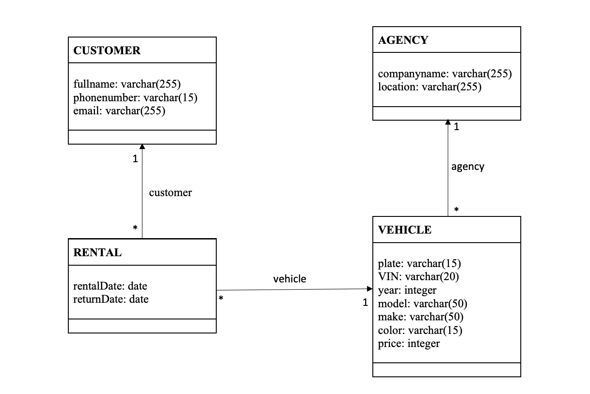

# MiniCarRentalDatabase
This is a simple modification of a car rental system. This diagram focuses on cars being rented by customers with a specific pickup and return dates. Each rental is associated with one vehicle at a specific agency. The diagram does not mention situations when a vehicle can have different pick-up and drop-off locations just for the simplicity of this system. It is only allowing all the vehicles to have the same pick-up and drop-off locations.

